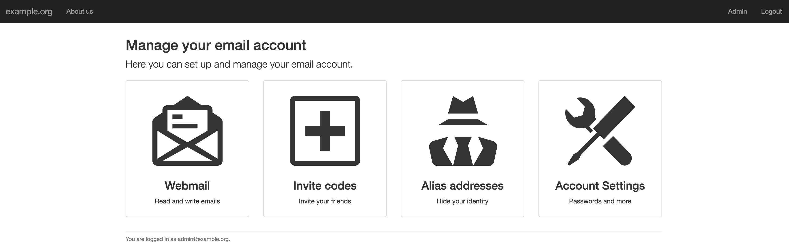

# Userli

Web application to (self-) manage email users and encrypt their mailboxes.

## Features

* User self-service (change password/recovery token, set aliases, ...)
* Invite code system (new users get three invite codes after one week)
* Domain admins (accounts with admin rights for one domain)
* Random alias feature for users
* Recovery tokens to restore accounts when password got lost
* Support for [Dovecot mailbox encryption](https://wiki.dovecot.org/Plugins/MailCrypt)
* Multi-language support (English, Spanish, Portuguese and German provided)

## Installation

Find more information on [how to install Userli](https://systemli.github.io/userli/getting-started/) in
our docs.

## Upgrading

Please see `UPGRADE.md` for instructions on how to upgrade from an earlier
release and also check `CHANGELOG.md` for important changes.

## Get involved!

Userli is free software and we're looking forward to your contribution.
If you're looking for things to work on, take a look in
[our issue tracker](https://github.com/systemli/userli/issues) and especially
the ["good first
issues"](https://github.com/systemli/userli/labels/good%20first%20issue).
There, you can also [report a bug or suggest an enhancement](https://github.com/systemli/userli/issues/new).
You could also [improve our documentation](https://github.com/systemli/userli/blob/master/hugo/content/_index.md) or [provide new
translations](https://hosted.weblate.org/engage/userli/).
If you want to do  something else - it's totally fine. Any contribution is very welcome.

Please note that everyone involved with this project is expected to follow our
[Code of Conduct](https://systemli.github.io/userli/development/code_of_conduct/).

See more information on how to [set up your development
environment](https://systemli.github.io/userli/development/)
in our docs.

## Copyright

Files: *  
Copyright: (c) 2015-2019 systemli.org  
License: AGPL v3 or later  

Files: assets/images/*.svg  
Copyright: (c) github.com  
License: MIT
