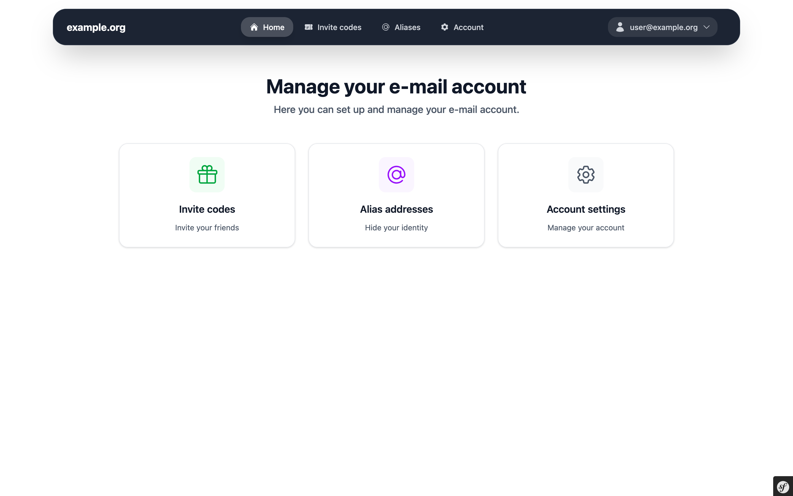

# Userli

Web application to (self-) manage e-mail users and encrypt their mailboxes.

## Features

* User self-service (change password/recovery token, set aliases, ...)
* Invite code system (new users get three invite codes after one week)
* Domain admins (accounts with admin rights for one domain)
* Random alias feature for users
* Recovery tokens to restore accounts when password got lost
* Support for [Dovecot mailbox encryption](https://wiki.dovecot.org/Plugins/MailCrypt)
* Multi-language support (English, French, Spanish, Portuguese, Bokmål, and German provided)

## Roles

Userli supports a role system to help you run your mail server.

* User - Default role
* Multiplier - Like user but with unlimited invite codes
* Suspicious - User without invite codes
* Spam - This account is suspected to be hacked and can't send mail anymore
* Permanent - Don't delete this account in user cleanup 
* Domain-Admin - Can add/edit/delete users and aliases for their domain
* Admin - Can add/edit/delete all available data

## Contribute

This is a start. Please help to [improve the documentation](https://github.com/systemli/userli/edit/main/docsindex.md).
