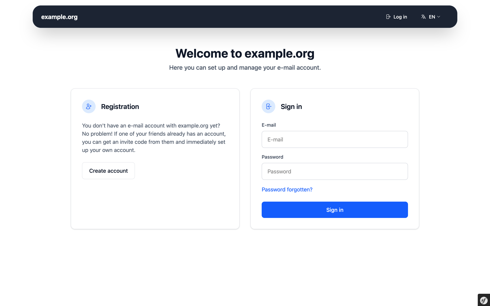
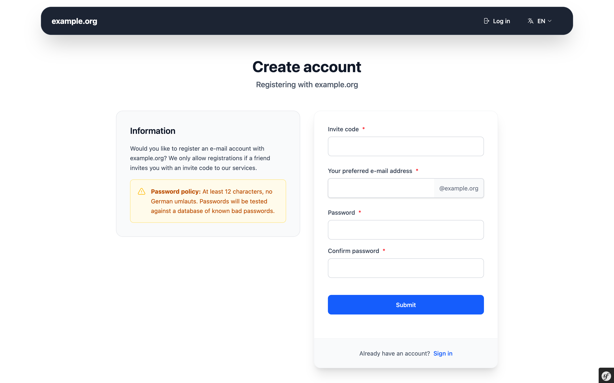
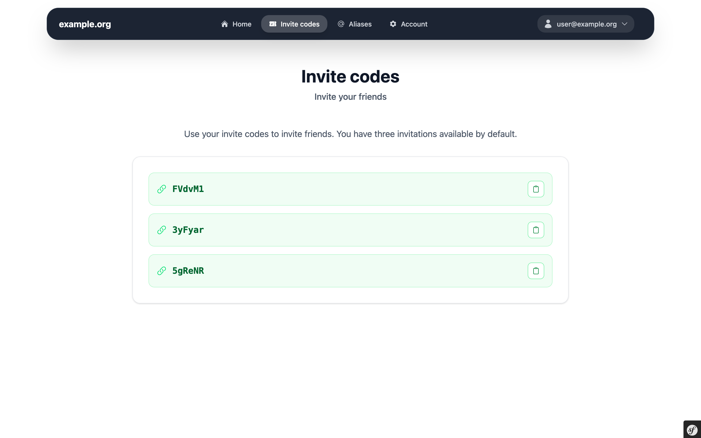
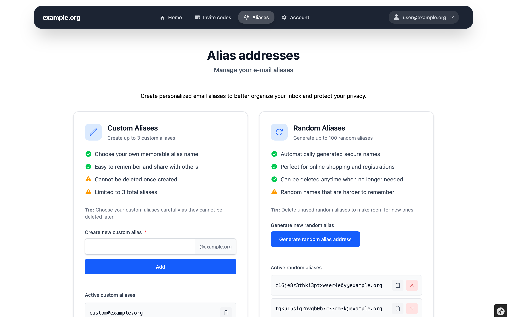
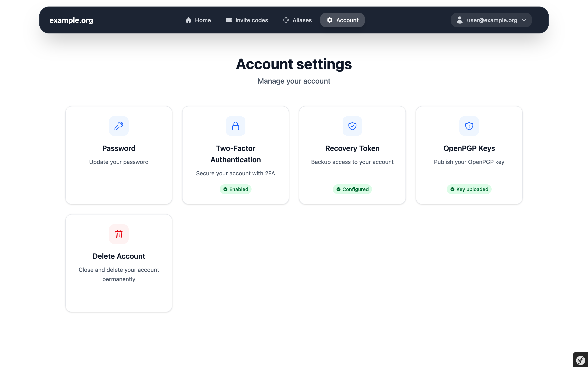
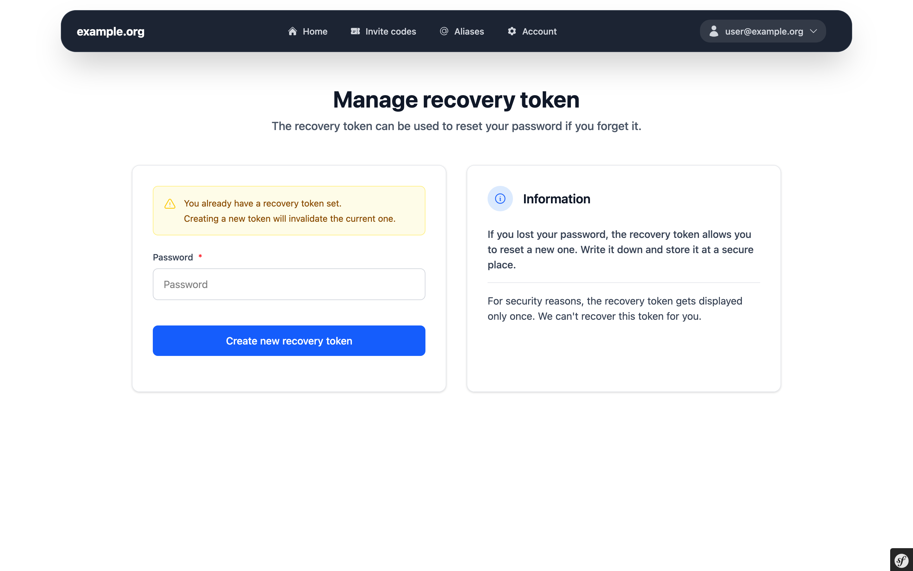
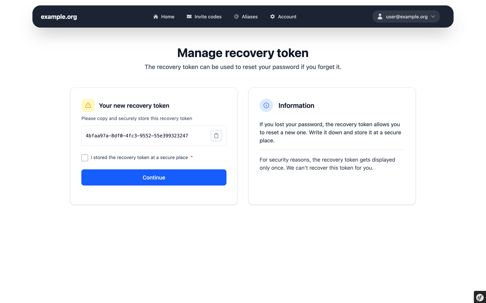
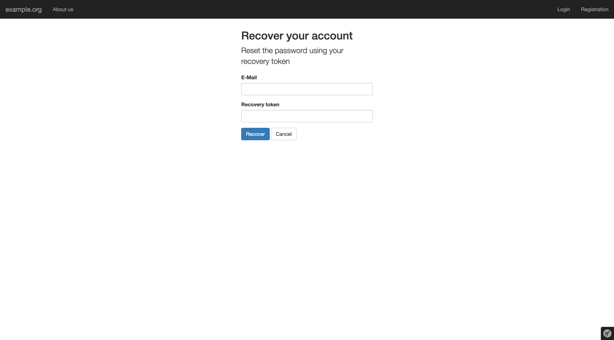
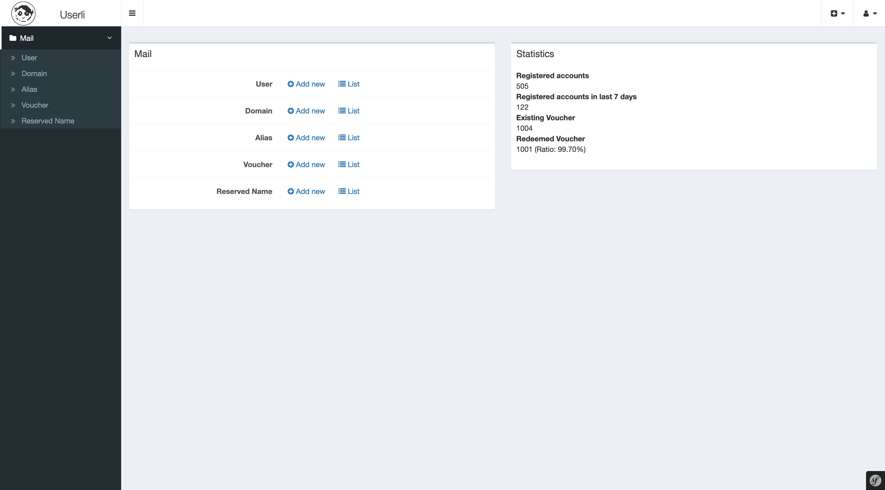

# Screenshots

Here you can find screenshots of the web interface of Userli.

## Start page

{class="screenshot"}

## Register

{class="screenshot"}

## Login

{class="screenshot"}

## Invite codes

{class="screenshot"}

## Aliases

{class="screenshot"}

## Account settings

{class="screenshot"}

## Account settings - Recovery Code

{class="screenshot"}

{class="screenshot"}

## Password Recovery

{class="screenshot"}

## Admin Frontend

{class="screenshot"}
