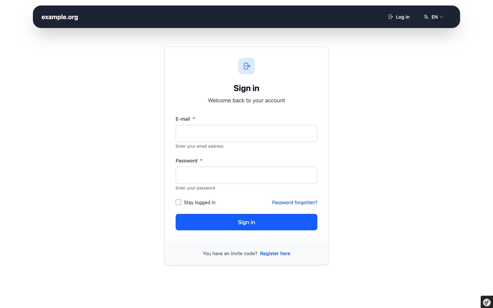

# Screenshots

Here you can find screenshots of the web interface of Userli.

## Start page

## Register

## Login

## Invite codes

## Aliases

## Account settings

## Account settings - Recovery Code

## Password Recovery

## Admin Frontend

